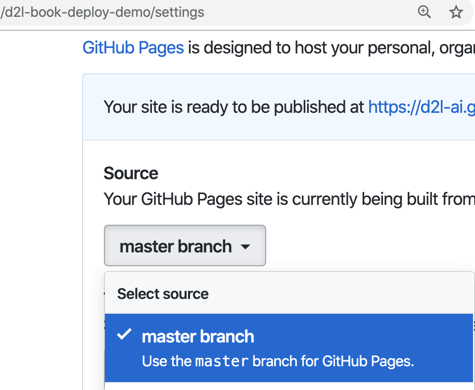

# Deploying

You can copy the built result to any your favorite place that can server contents online. Otherwise `d2lbook` provides two ways to deploy your build results.

## Deploying Through Github

[Github Pages](https://pages.github.com/) allow us to host a website through a Github repo. To do so, we first need to create a github repo, for example we created [d2l-ai/d2l-book-deploy-demo](https://github.com/d2l-ai/d2l-book-deploy-demo) for this example. Then enable serving from the master branch in `Settings -> GitHub Pages`. You will get a URL to access it. It is [d2l-ai.github.io/d2l-book-deploy-demo](https://d2l-ai.github.io/d2l-book-deploy-demo/) for this example. You can add anything to `README.md`, which will not show on the website.


:width:`400px`

Now let's create a project with `[deploy] github_repo` specified and build both HTML and PDF.

```{.python .input}
!mkdir -p deploy
```

```{.python .input}
%%writefile deploy/index.md
# Deploying Demo for d2lbook

This is a demo to deploy on Github.

````toc
get_started
````
```

```{.python .input}
%%writefile deploy/get_started.md
# Getting Started

Please first install my favorite package `numpy`.
```

```{.python .input}
%%writefile deploy/config.ini
[project]
name = deply-demo

[html]
header_links = PDF, https://https://d2l-ai.github.io/d2l-book-deploy-demo/deply-demo.pdf, fas fa-file-pdf

[deploy]
github_repo = d2l-ai/d2l-book-deploy-demo
```

```{.python .input}
!cd deploy; d2lbook build html pdf
```

To deploy to Github, you need to have your machine's [SSH key imported to Github](https://github.com/settings/keys). Otherwise, you may need to type in your account and password.

```{.python .input}
!cd deploy; d2lbook deploy html pdf
```

## Deploying Through AWS

TODO.

```{.python .input}
!rm -rf deploy
```
